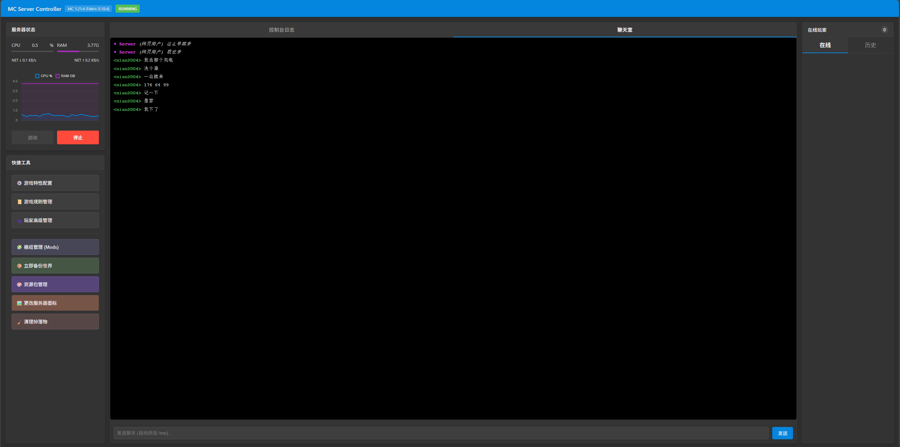

# Minecraft Server Controller

一个轻量级 Minecraft 服务器网页管理面板。它允许你直接通过浏览器远程管理服务器状态、查看实时日志、管理玩家和配置游戏规则。



## 主要特性

- **实时日志流**: 采用 Socket.io 技术，秒级延迟获取服务器最新日志。
- **远程控制台**: 在网页端直接发送游戏指令，支持命令历史。
- **文件管理与上传**:
  - **模组上传**: 支持直接通过网页上传 `.jar` 模组文件。
  - **资源包上传**: 支持上传资源包并自动计算 SHA-1 校验码。
  - **备份功能**: 自动集成路径映射，方便下载服务器备份。
- **玩家管理面板**:
  - 查看实时在线玩家。
  - 快速执行：OP、De-OP、Kick、Ban。
  - 白名单管理。
- **游戏规则 (GameRules) 配置**: 集成常用游戏规则设置，支持即时生效。
- **全方位系统监控**: 使用 Chart.js 可视化展示服务器 CPU、内存、网络 IO（入站/出站）以及磁盘占用情况。
- **安全保障**: 登录系统保护，采用 SHA-256 加密验证。
- **自动检测**: 自动识别服务器版本、Loader 类型（Vanilla, Fabric, Forge, NeoForge）。
- **进程接管与持久化**: 基于 Linux `screen` 会话运行，即使面板重启也能自动接管已在运行的 Minecraft 进程。

## 依赖项要求

在运行本项目之前，请确保你的系统环境满足以下要求：

### 1. 系统环境
- **操作系统**: 推荐使用 **Linux** (如 Ubuntu, Debian, CentOS)。
  - *注：本项目依赖 `screen` 和 `tail` 命令，Windows 环境需在 WSL 或特定的类 Unix 环境下运行。*
- **Java**: 运行 Minecraft 服务器所需的 JRE/JDK。
- **Node.js**: 推荐版本 v16.x 及以上。

### 2. 系统级工具
你需要安装以下终端工具：
- `screen`: 用于持久化 Minecraft 进程。
- `tail`: 用于实时捕获游戏日志。

### 3. Node.js 扩展库
本项目依赖以下 npm 模块（**无需手动下载，详见安装步骤**）：
- `express`: Web 基础框架。
- `socket.io`: 实现控制台实时日志流。
- `multer`: 处理文件上传。

## 安装与部署

1. **环境准备 (以 Ubuntu 为例)**:
   ```bash
   sudo apt update
   sudo apt install nodejs npm screen coreutils openjdk-17-jre-headless -y
   ```

2. **获取文件**:
   将项目源码放入你的 Minecraft 服务器目录。

3. **安装依赖库**:
   在项目根目录下运行以下命令，这会自动安装 `package.json` 中列出的所有依赖：
   ```bash
   npm install
   ```

4. **服务器配置**:
   打开 `server.js` 并修改以下变量：
   ```javascript
   const MC_JAR = 'server.jar'; // 你的服务端 jar 文件名
   const MIN_RAM = '2G';        // 最小内存
   const MAX_RAM = '6G';        // 最大内存
   const PORT = 8080;           // 面板访问端口
   const PASSWORD_HASH = '...'; // SHA-256 密码哈希
   ```

5. **设置登录密码**:
   默认密码哈希在 `server.js` 中定义。如果要修改密码，请生成你新密码的 **SHA-256** 哈希值，并替换 `PASSWORD_HASH` 变量：
   - 示例（Linux 命令行生成）: `echo -n "你的新密码" | sha256sum`
   - 将输出的长字符串填入 `server.js`。

6. **启动面板**:
   ```bash
   npm start
   ```
   随后通过 `http://你的服务器IP:{PORT}` 即可访问。

## 配置文件说明

- `package.json`: 定义 Node.js 依赖及启动脚本。
- `server.js`: 后端核心逻辑，负责与 Minecraft 进程交互、日志读取及权限校验。
- `public/`: 存放前端 UI 相关资源。
- `server_history.log`: 记录面板的操作与日志流历史。

## 致谢

本项目使用了以下优秀的开源项目：

- [Node.js](https://nodejs.org/) - JavaScript 运行时
- [Express](https://expressjs.com/) - 极简且灵活的 Node.js Web 应用框架
- [Socket.io](https://socket.io/) - 跨平台实时通信库
- [Chart.js](https://www.chartjs.org/) - 简单灵活的客户端图表库
- [Multer](https://github.com/expressjs/multer) - 用于处理 `multipart/form-data` 的 Node.js 中间件
- [GNU Screen](https://www.gnu.org/software/screen/) - 终端复用器
- ~~以及陪我玩游戏的朋友~~(并非开源)

## 许可证

项目采用 [MIT License](LICENSE) 开源许可证。

---

*Made with ❤️ for the Minecraft Community.*
